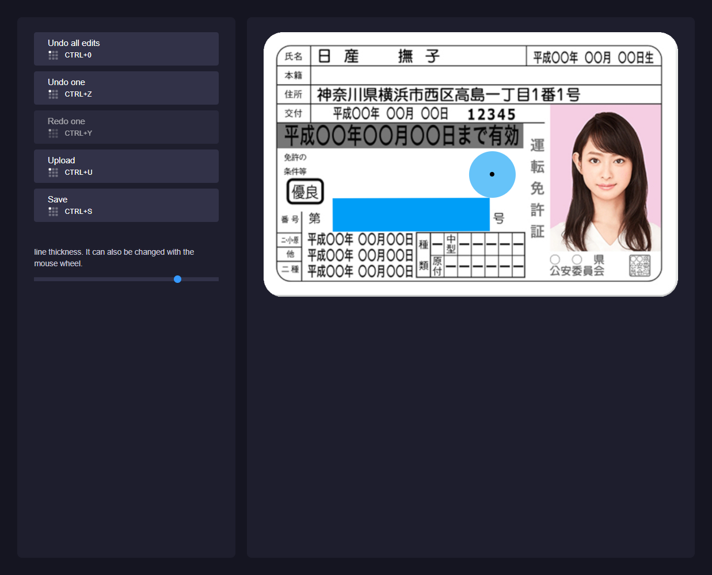

# fabric-examples
Example of Canvas operation with fabric.

Access the demo [here](https://takuya-motoshima.github.io/fabric-examples/).

## Documentation
- [Demos — Fabric.js Javascript Canvas Library](http://fabricjs.com/demos/)
- [javascript - Fabric.js - Free draw a rectangle - Stack Overflow](https://stackoverflow.com/questions/9417603/fabric-js-free-draw-a-rectangle)
- [Draw rectangle by dragging with mouse like ms paint · Issue #5861 · fabricjs/fabric.js](https://github.com/fabricjs/fabric.js/issues/5861)
- [Useful information on the background size of fabric.js](https://stackoverflow.com/questions/44416109/canvas-client-size-in-fabric-js)

## Author
**Takuya Motoshima**

* [github/takuya-motoshima](https://github.com/takuya-motoshima)
* [twitter/TakuyaMotoshima](https://twitter.com/TakuyaMotoshima)
* [facebook/takuya.motoshima.7](https://www.facebook.com/takuya.motoshima.7)

## License
[MIT](LICENSE)